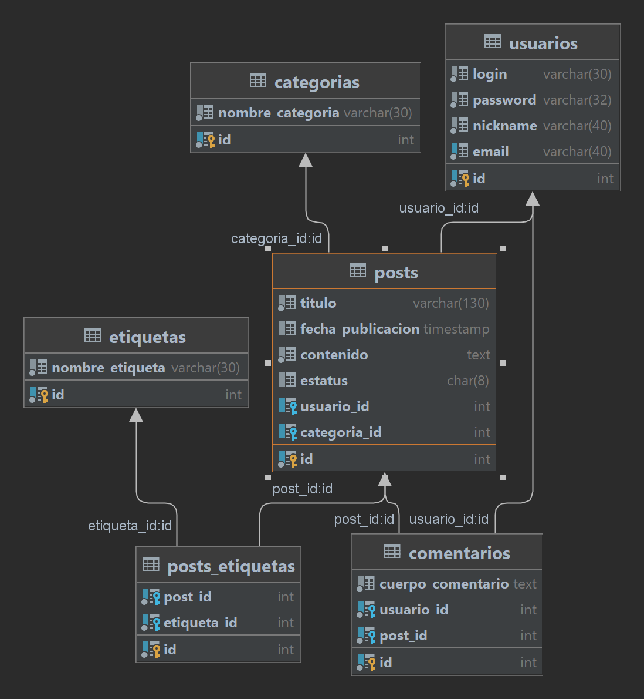

# Platzi blog

El proyecto de este curso consistio en la creacion de una base de datos de blogs, yo decidí crear un esquema parecido al de platzi, donde las categorías son algunas de las escuelas, y las etiquetas las herramientas utilizadas en las mismas

## Recreacion de proyecto:
* Para este proyecto utilicé una base de datos relacional MySQL (version 8.0 o MySQL80), y el IDE DataGrip (se pueden utilizar tambien herramientas gratuitas como MySQL Workbench o DBeaver, este ultimo lo recomiendo)
* Ejecutar script _table_creations.sql_ para crear las tablas utilizadas

Esquema obtenido (archivo platzi_blog.png):

* Ejecutar script _data_imports.sql_ para importar datos inventados (aproximadamente 10 por tabla) para luego poder realizar consultas

Preview de algunas tablas presentes:

### usuarios:

| id | login | password | nickname | email |
| :--- | :--- | :--- | :--- | :--- |
| 1 | patricio | password1 | pato | patricio@platzi.com |
| 2 | celeste | password2 | cele | celeste@platzi.com |
| 3 | facundo | password3 | faq | facundo@platzi.com |
| 4 | joaquin | password4 | joako | joaquin@platzi.com |
| 5 | lautaro m | password5 | lauty | lautaro@platzi.com |
| 6 | rocio | password6 | ro | rocio@platzi.com |
| 7 | alejo | password7 | ale | alejo@platzi.com |
| 8 | agustin f | password8 | aura | aura@platzi.com |
| 9 | lautaro c | password9 | canosa | canosa@platzi.com |
| 10 | candela | password10 | cande | candela@platzi.com |
| 11 | agustin p | password11 | chipy | chipy@platzi.com |
| 12 | luna | password12 | chumi | chumi@platzi.com |
| 13 | martin | password13 | mania | mania@platzi.com |
| 14 | bruno | password14 | bruno | bruno@platzi.com |

### posts:

| id | titulo | fecha\_publicacion | contenido | estatus | usuario\_id | categoria\_id |
| :--- | :--- | :--- | :--- | :--- | :--- | :--- |
| 1 | Título del primer post | 2023-03-17 22:58:32 | Contenido del primer post | activo | 1 | 1 |
| 2 | Título del segundo post | 2023-03-17 22:58:32 | Contenido del segundo post | activo | 2 | 2 |
| 3 | Título del tercer post | 2023-03-17 22:58:32 | Contenido del tercer post | activo | 3 | 1 |
| 4 | Título del cuarto post | 2023-03-17 22:58:32 | Contenido del cuarto post | activo | 4 | 3 |
| 5 | Título del quinto post | 2023-03-17 22:58:32 | Contenido del quinto post | activo | 5 | 4 |
| 6 | Título del sexto post | 2023-03-17 22:58:32 | Contenido del sexto post | activo | 6 | 2 |
| 7 | Título del séptimo post | 2023-03-17 22:58:32 | Contenido del séptimo post | activo | 7 | 3 |
| 8 | Título del octavo post | 2023-03-17 22:58:32 | Contenido del octavo post | activo | 8 | 5 |
| 9 | Título del noveno post | 2023-03-17 22:58:32 | Contenido del noveno post | activo | 9 | 2 |
| 10 | Título del décimo post | 2023-03-17 22:58:32 | Contenido del décimo post | activo | 10 | 4 |
